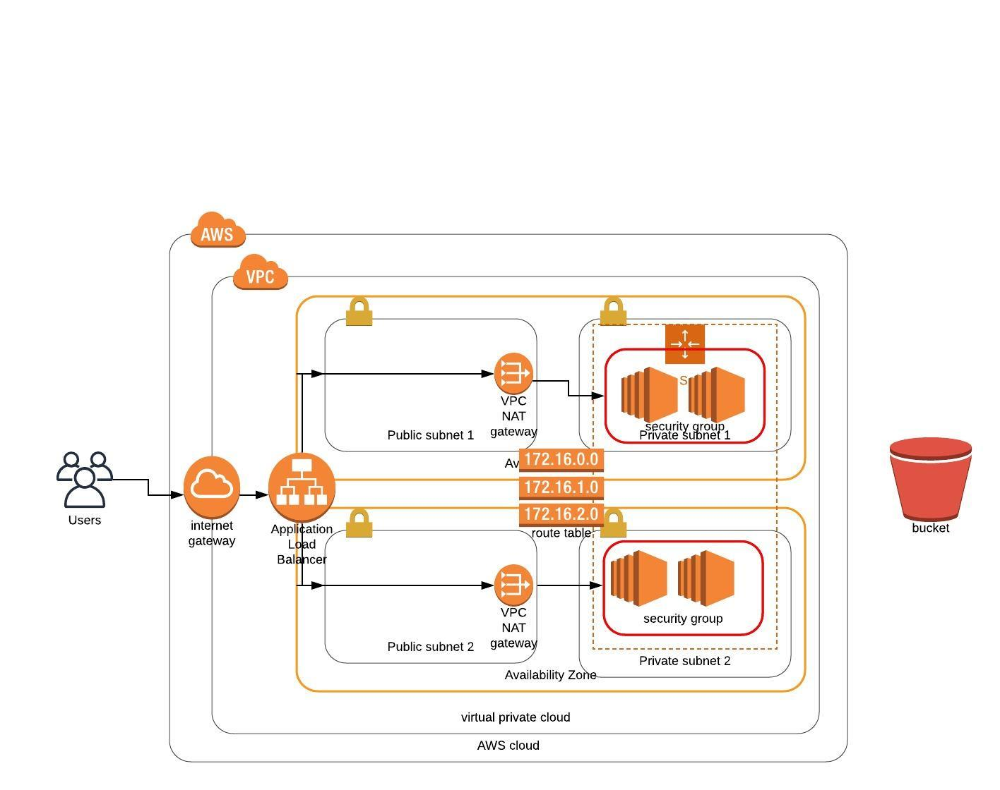

# High-availability web app using CloudFormation

Project 2 using `CloudFormation` tool to deploy Network infrastructure for Simple Web app. It follows same security aspects which we can expect in real world cloud App.

## What are the components of this Project?
* `Network Infrastructre Component` - It includes script for setting up network infra for the project. It has 2 public subnet and 2 private subnet. Load Balance is the only server from where our request route to this server.
[Link to Script](./network.yml).

* `Server Component` - It Setup server's needed for the Application to serve the request coming from load balance to server instances. [Link to Script](./server.yml).

## what are the requirements to run it ?

  Amazon aws account and a bucket having public access to code to deploy on server . Check userData section in `server.yml` file to configure the bucket.

## Deployment Steps:
* `Setup AWS credentials` - Create IAM user account to deploy infrastructure on Cloud.
* `Setup Network and server` -  Run below command
    * $ ./create.bat `stackName-network` network.yml network-parameters.json

    * $ ./create.bat `stackName-server` servers.yml servers-parameters.json
* `Delete stack` - To delete the stack use command => `$. ./delete.bat stackName_here`

## Lets Query Server
 * Check the output section for deployed stack in `CloudFormation`. You will find the url of the load balancer for access.
 * It looks like this, http://``name``.``region_name``.elb.amazonaws.com/
